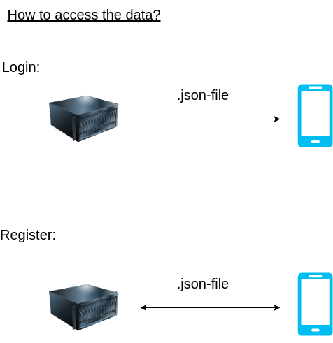
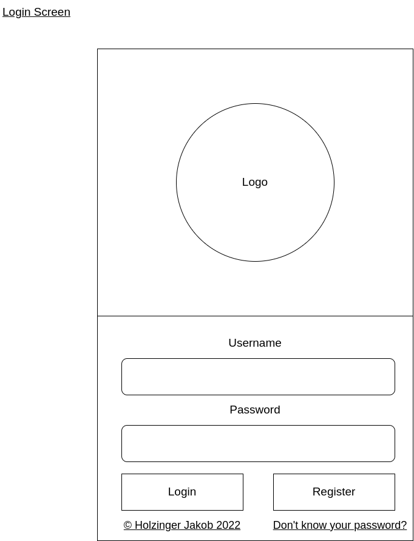
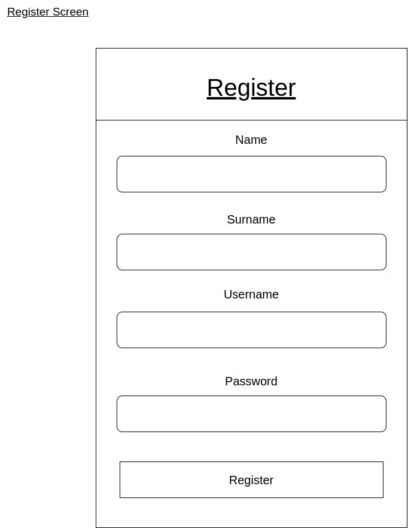

## Concept for the App
-----------
- Author: Holzinger Jakob
- Version: 1.0
- Date: 24.02.2022

### **Register-Login Concept**
Userdata is saved in an encrypted json-file on a nodejs webserver. Each time the user presses the Login Button, the content of the formular gets compared to the entrys in the json file. If it is inside the .json, the user will be logged in with his credentials. If a User has typed in the wrong credentials, he will be prompted with a message on screen, which tells him so.

**Json-File-Structure:**
```json
{
    "users":{
        "1": [{
            "name":"Jakob",
            "surname":"Holzinger",
            "username":"Woodiii",
            "password":"securePassword123"
        }],
        "2": [{
            "name":"Patrick",
            "surname":"Grubauer",
            "username":"GrubPa",
            "password":"securePassword122"
        }]
    }
}
```

### **How to access the data for the register/login process?**




### **GUI-Draft for the register/login screen**




